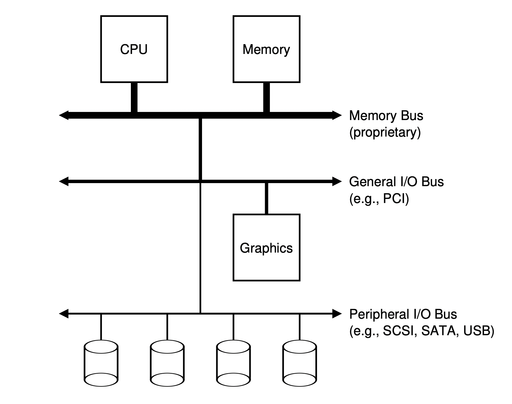
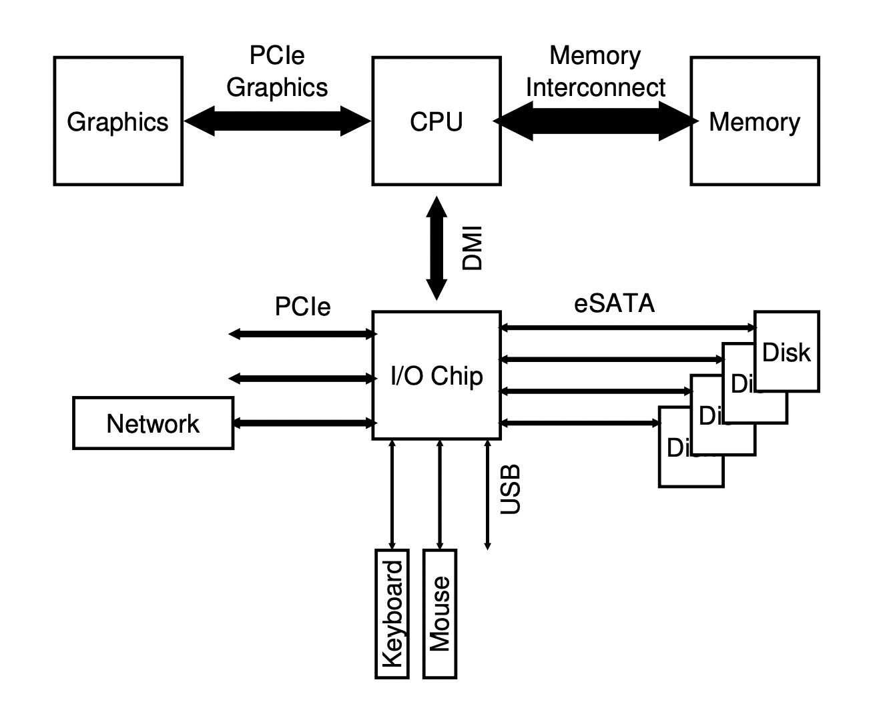
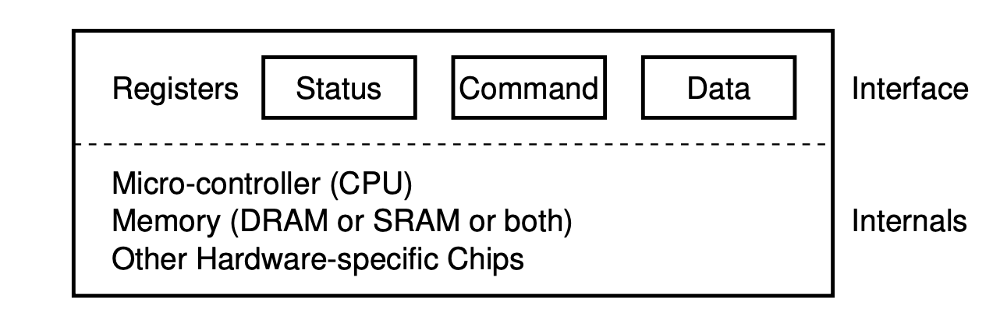
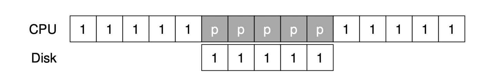
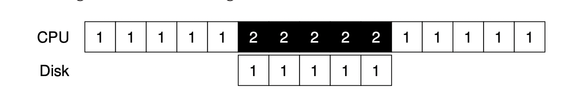
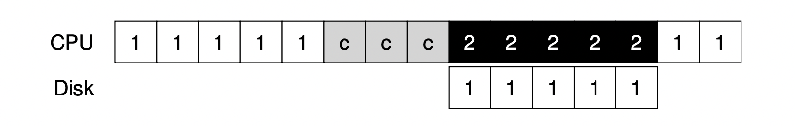

### I/O Devices

#### introduction

Input/Output are very important for computers. Without them, computers do not make any sense. 

=>

1. Integrate I/O into systems
2. general mechanisms
3. Make them efficient

#### system architecture

(1)Classical diagram of a typical system:



From top to bottom, performance of devices decreases in order.

(2)The reason of adopting a hierarchical architecture:

It is all about physics and cost.

About physics, the faster a bus is, the shorter it must be. Thus, a high-performance memory bus does not have much room to plug devices into it.

For the perspective of cost, engineering a high-performance bus is quite costly.

Summary:

1. Components demand high performance are nearer the CPU. Low performance components are far away.
2. We can put a lot of devices on a peripheral bus.

(3)Modern system architecture:



Key point and terminology:

1. Modern system would make use of specialized chipsets and point-to-point interconnects to improve performance.
2. DMI: direct media interface
3. eSATA: external SATA
4. PCIe: peripheral component interconnect express

#### A canonical device

A device has two important components: interface(abstraction) and internal structure(implementation). Just like this:



#### The canonical protocol

Device interface is comprised of 3 registers(see picture above): **Status** register, **Command** register and **Data** register. OS reads and writes these registers to get the device to do something on its behalf. A simple but inefficient canonical protocol between OS and device would be like this:

```
While (status == BUSY); // wait until device is not busy
Write data to DATA REGISTER;
Write data to COMMAND REGISTER;
While (status == BUSY); // wait until device is done with your request
```

Inefficiencies and inconveniences:

1. Polling the device wastes a great deal of CPU time.
2. Programmed I/O(main CPU writes data to DATA register)

=>

OS needs to check the status without polling and lowers the CPU overhead to manage the device.

#### Lowering CPU overhead with interrupts

(1)Specific flows of *interruption*

System Call => OS issues a request => put the calling process to sleep and context switch to another process => device raises a hardware interrupt => CPU jumps into the OS at a predefined **interrupt service routine(ISR)** or **interrupt handler** => OS finishes the request and wakes the calling process.

Interrupts allow for **overlap** of computation and I/O => improve utilization.



=>



(1 and 2 mean the concrete process that utilize CPU. p means CPU is polling.)

(2)**Tradeoff** between **interrupt** and **poll**

1. Switching to another process, handling the interrupt, switching back to the issuing process is expensive.

2. For fast device, polling is good. For slow device, interrupt is good. It is because that the cost of switching and handling interrupt may outweigh the benefit of overlap. If the speed of device is not known(we could not predict the exact distribution of speed), or sometimes fast, sometimes slow, using a **hybrid** that polls for a while, and then uses interrupt may be best.

3. Processing multiple interrupts may cause **livelock** for OS which means OS only processes interrupts but not requests of users.

4. Interrupt-based optimization: **coalescing**

   The device waits for a bit before delivering interrupt to CPU. It is the same as **batch processing**. But there is still a tradeoff between **interrupt cost** and **response time** about waiting time window or waiting queue size.

#### More efficient data movement with DMA

When using **programmed I/O** to transfer a large chunk of data to a device, CPU wastes a lot of time. Timeline would be like this:



With **PIO**, CPU spends too much time moving data to and from devices by hand.